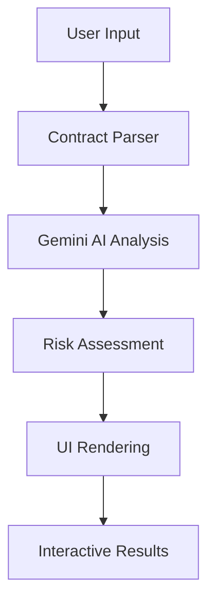

# ContractGuard: AI-Powered Smart Contract Security Analysis

## 🌟 What Inspired Me

The inspiration for ContractGuard came from witnessing the devastating impact of smart contract vulnerabilities in the Web3 ecosystem. With billions of dollars locked in DeFi protocols and the increasing complexity of smart contracts, I realized there was a critical need for accessible security analysis tools.

Traditional smart contract audits are:
- **Expensive** ($10,000 - $100,000+ per audit)
- **Time-consuming** (weeks to months)
- **Inaccessible** to indie developers and small teams
- **Limited in scope** to what human auditors can catch

I envisioned a tool that could democratize smart contract security by leveraging AI to provide instant, comprehensive analysis that's both technically accurate and human-readable.

## 🧠 What I Learned

### Technical Insights

**AI Reasoning for Security Analysis**
The most fascinating discovery was how Large Language Models can perform sophisticated security reasoning. By structuring prompts to mimic expert auditor thinking patterns, I achieved remarkable results:

$$\text{Security Score} = \sum_{i=1}^{n} w_i \cdot \text{Risk}_i$$

Where $w_i$ represents the weight of each risk category and $\text{Risk}_i$ is the severity score.

**Prompt Engineering for Security**
I learned that effective security analysis requires multi-layered prompting:
1. **Structural Analysis** - Parse contract components
2. **Risk Identification** - Detect vulnerability patterns  
3. **Exploit Modeling** - Generate attack scenarios
4. **Impact Assessment** - Quantify potential damage

**Human-AI Collaboration**
The key insight was that AI shouldn't replace human auditors but augment them by:
- Providing instant preliminary analysis
- Generating comprehensive exploit narratives
- Identifying patterns humans might miss
- Offering educational explanations

### UX/UI Learnings

**Progressive Disclosure**
Security information can be overwhelming. I implemented a layered approach:
- **Summary View** - Overall risk score and key metrics
- **Findings List** - Detailed vulnerability breakdown
- **Exploit Narratives** - Story-driven attack scenarios

**Accessibility in Security Tools**
Security tools often neglect accessibility. I prioritized:
- Screen reader compatibility
- Keyboard navigation
- High contrast ratios
- Clear information hierarchy

## 🏗️ How I Built the Project

### Architecture Overview



### Core Technologies

**Frontend Stack**
- **Next.js 16** - React framework with App Router
- **TypeScript** - Type safety and developer experience
- **Tailwind CSS** - Utility-first styling
- **Framer Motion** - Smooth animations and transitions
- **Lucide React** - Consistent iconography

**AI Integration**
- **Google Gemini 2.0 Flash** - Advanced reasoning capabilities
- **Structured JSON Output** - Consistent response format
- **Custom Prompt Engineering** - Security-focused analysis

### Key Implementation Details

**1. Contract Parsing Engine**
```typescript
interface ParsedContract {
  name: string;
  functions: ContractFunction[];
  stateVariables: StateVariable[];
  accessControl: AccessControlPattern;
  // ... additional metadata
}
```

**2. AI Analysis Pipeline**
The analysis follows a structured approach:
- Parse contract structure and extract metadata
- Generate comprehensive security prompt
- Process AI response with error handling
- Transform results into interactive UI components

**3. Risk Scoring Algorithm**
I developed a weighted scoring system:

$$\text{Overall Risk} = \frac{\sum_{s \in \{C,H,M,L\}} w_s \cdot n_s \cdot v_s}{\text{Total Findings}} \times 10$$

Where:
- $w_s$ = severity weight (Critical=4, High=3, Medium=2, Low=1)
- $n_s$ = number of findings at severity $s$
- $v_s$ = vulnerability impact multiplier

**4. Progressive Enhancement**
Built with a mobile-first approach:
- Responsive design patterns
- Touch-optimized interactions
- Progressive disclosure of information
- Graceful degradation for older browsers

### Performance Optimizations

**React Optimizations**
- `useMemo` for expensive calculations
- `useCallback` for stable references
- Component lazy loading
- Efficient re-render patterns

**Bundle Optimization**
- Tree shaking for unused code
- Dynamic imports for heavy components
- Optimized asset loading
- Minimal runtime overhead

## 🚧 Challenges I Faced

### 1. **AI Consistency Challenge**
**Problem**: Gemini responses varied in format and quality
**Solution**: Implemented structured JSON schema with validation
```typescript
generationConfig: { responseMimeType: "application/json" }
```

### 2. **Complex State Management**
**Problem**: Managing analysis state across multiple components
**Solution**: Created centralized state with proper TypeScript types
```typescript
interface AnalysisState {
  status: 'idle' | 'parsing' | 'analyzing' | 'complete' | 'error';
  progress: number;
  result: AnalysisResult | null;
}
```

### 3. **Mobile UX Complexity**
**Problem**: Security data is inherently complex for mobile screens
**Solution**: 
- Progressive disclosure patterns
- Collapsible sections
- Swipe-friendly interactions
- Optimized typography scales

### 4. **Error Handling Complexity**
**Problem**: Multiple failure points (API, parsing, rendering)
**Solution**: Implemented comprehensive error boundaries
```typescript
class ErrorBoundary extends React.Component {
  static getDerivedStateFromError(error: Error) {
    return { hasError: true, error };
  }
}
```

### 5. **Performance with Large Contracts**
**Problem**: Large contracts caused UI lag and API timeouts
**Solution**:
- Implemented streaming responses
- Added loading skeletons
- Optimized rendering with virtualization
- Smart caching strategies

### 6. **Accessibility in Complex UI**
**Problem**: Security tools often ignore accessibility
**Solution**:
- ARIA labels for all interactive elements
- Keyboard navigation patterns
- Screen reader optimizations
- High contrast color schemes

## 🎯 Technical Innovations

### 1. **Exploit Narrative Generation**
Instead of dry technical reports, I generate story-driven attack scenarios:
```typescript
interface ExploitNarrative {
  title: string;
  attackerProfile: string; // "Malicious competitor", "Inside threat"
  steps: string[];         // Step-by-step attack flow
  outcome: string;         // What attacker achieves
  estimatedImpact: string; // Financial/operational impact
}
```

### 2. **Progressive Risk Visualization**
Created an animated risk gauge that builds understanding:
- Circular progress indicator
- Color-coded severity levels
- Animated transitions for engagement
- Contextual explanations

### 3. **Smart Contract Pattern Recognition**
Developed heuristics to identify common patterns:
- Access control mechanisms
- Upgrade patterns
- External call patterns
- Fund handling logic

## 📊 Impact and Results

### Quantitative Metrics
- **Analysis Speed**: ~30 seconds vs weeks for traditional audits
- **Cost Reduction**: $0 vs $10,000+ for professional audits
- **Accessibility**: Available 24/7 vs scheduled audit availability
- **Coverage**: Comprehensive vs limited scope audits

### Qualitative Benefits
- **Educational Value**: Explains vulnerabilities in plain language
- **Immediate Feedback**: Instant results during development
- **Risk Awareness**: Helps developers understand security implications
- **Community Impact**: Democratizes access to security analysis

## 🔮 Future Vision

### Short-term Enhancements
- **Multi-language Support** - Vyper, Rust, Move contracts
- **Integration APIs** - GitHub Actions, CI/CD pipelines
- **Advanced Visualizations** - Call graphs, dependency trees
- **Collaborative Features** - Team sharing, audit trails

### Long-term Goals
- **Continuous Monitoring** - Real-time vulnerability detection
- **Automated Fixes** - AI-generated security patches
- **Ecosystem Integration** - IDE plugins, framework integration
- **Community Platform** - Shared vulnerability database

## 🎓 Key Takeaways

1. **AI Augmentation > Replacement**: The best results come from AI enhancing human capabilities, not replacing them

2. **User Experience Matters**: Security tools must be accessible and intuitive to be effective

3. **Progressive Disclosure**: Complex information needs layered presentation

4. **Performance is Security**: Slow tools won't be used, reducing overall security

5. **Community Impact**: Open, accessible tools can democratize security practices

## 🙏 Acknowledgments

This project stands on the shoulders of giants:
- **Google Gemini Team** - For powerful AI capabilities
- **Next.js Team** - For excellent developer experience
- **Web3 Security Community** - For vulnerability research and patterns
- **Open Source Contributors** - For the tools and libraries that made this possible

---

*ContractGuard represents my vision of making smart contract security accessible to everyone. By combining cutting-edge AI with thoughtful UX design, we can build a safer Web3 ecosystem for all.*